## Курс Surf: Flutter-разработчик 👩🏼‍💻
### [https://education.surf.ru](https://education.surf.ru) [старт курса 17 ноября 2020 г.]

Спасибо ребятам из Surf за предоставленную возможность. Мне было сложно, но интересно!

## Что в результате получилось 
Не всё идеально, но я только учусь 🤗

### Демонстрация работы

https://disk.yandex.ru/i/e6u_wW6eD_iuow

### Скрины

### Обнобоардинг

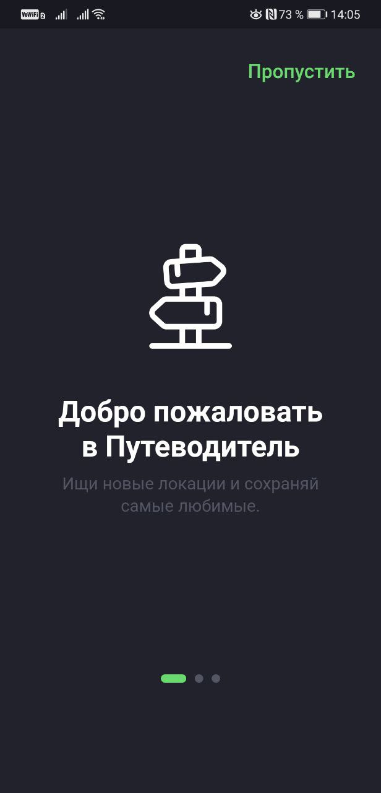

### Главный экран
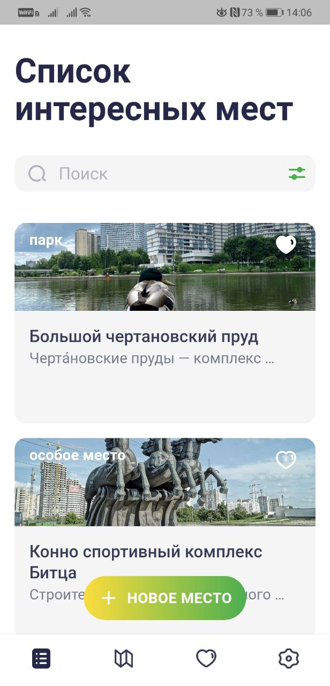
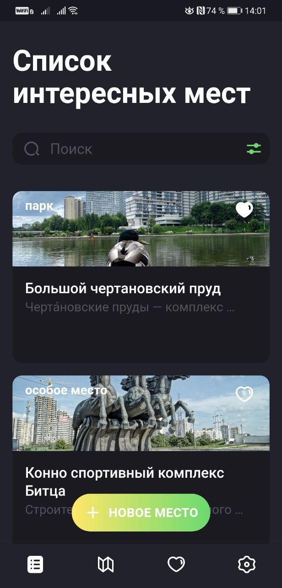

### Фильтр

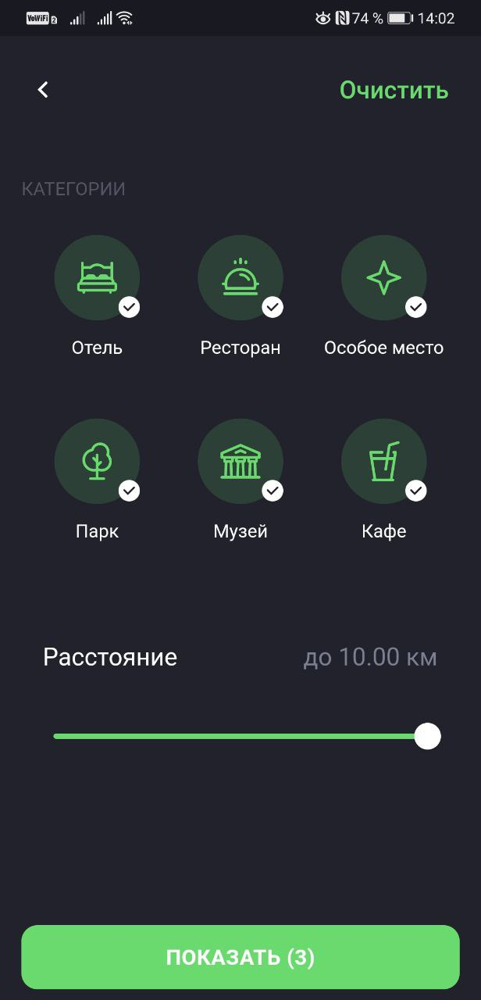

### Карта
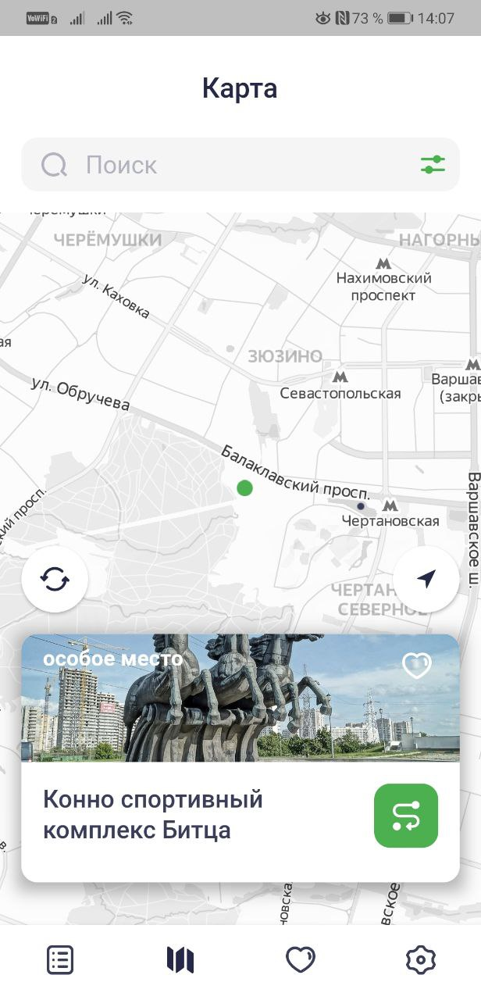
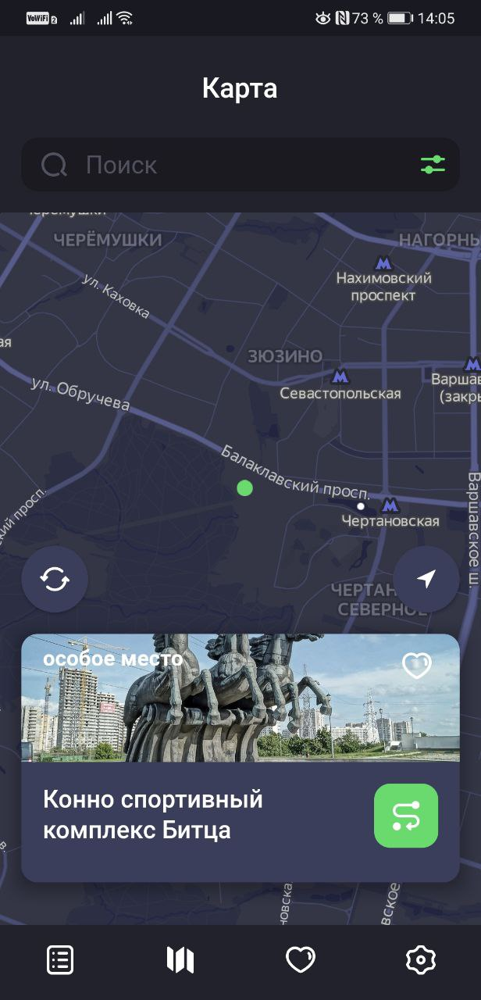

### Избранное
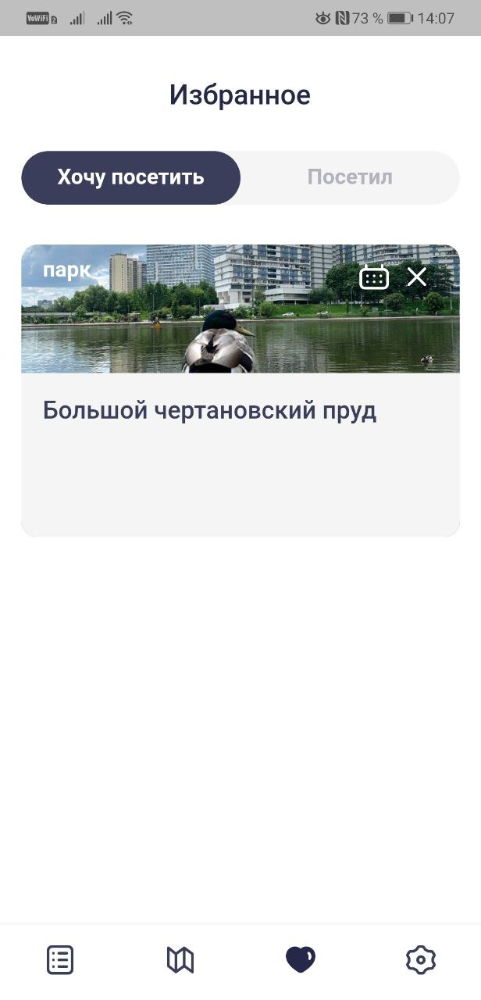
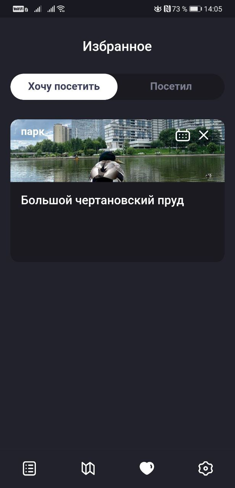

### Поиск
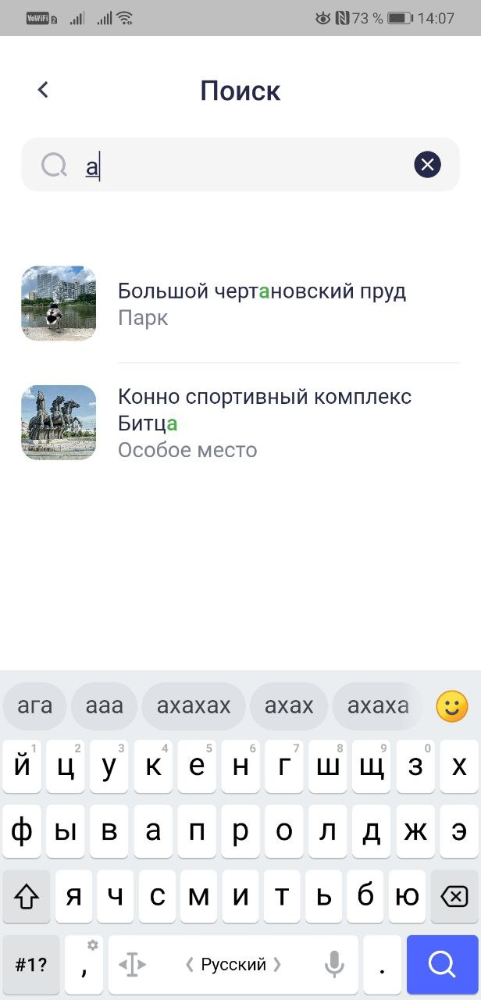
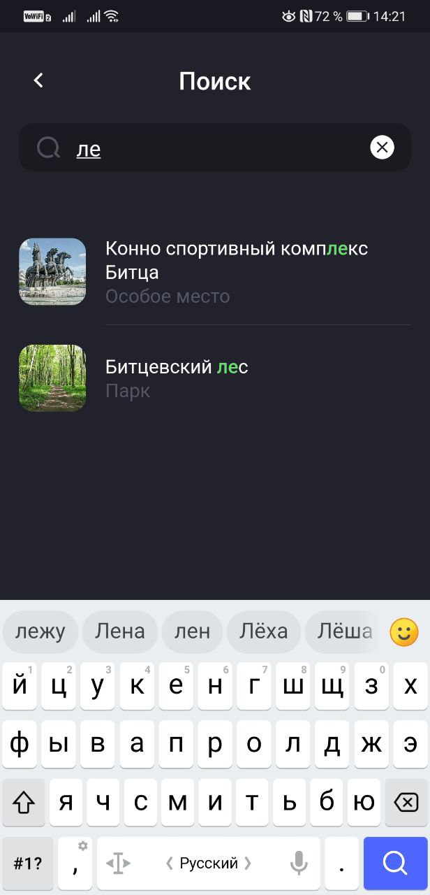

### Настройки
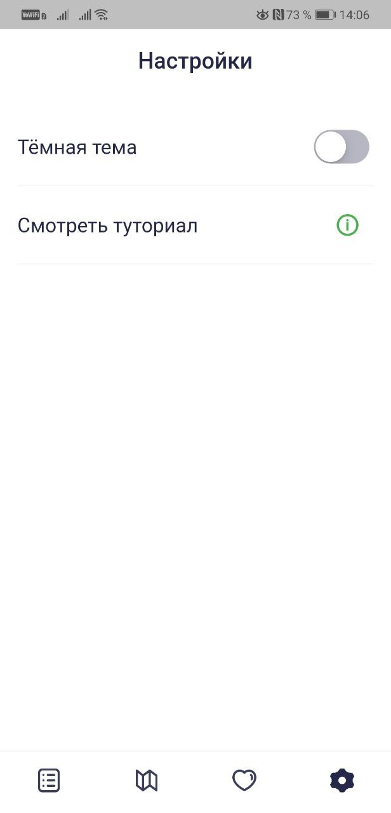
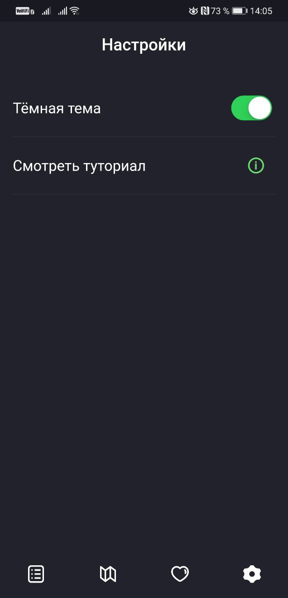

### Новое место
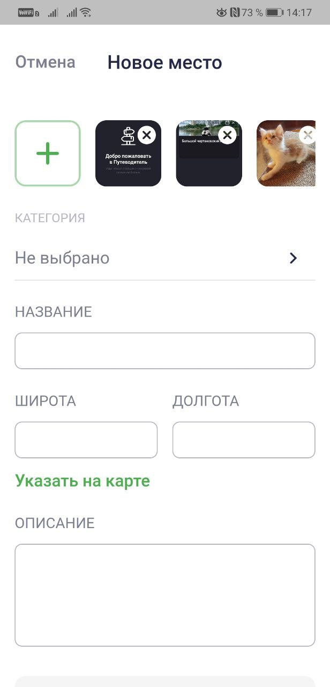
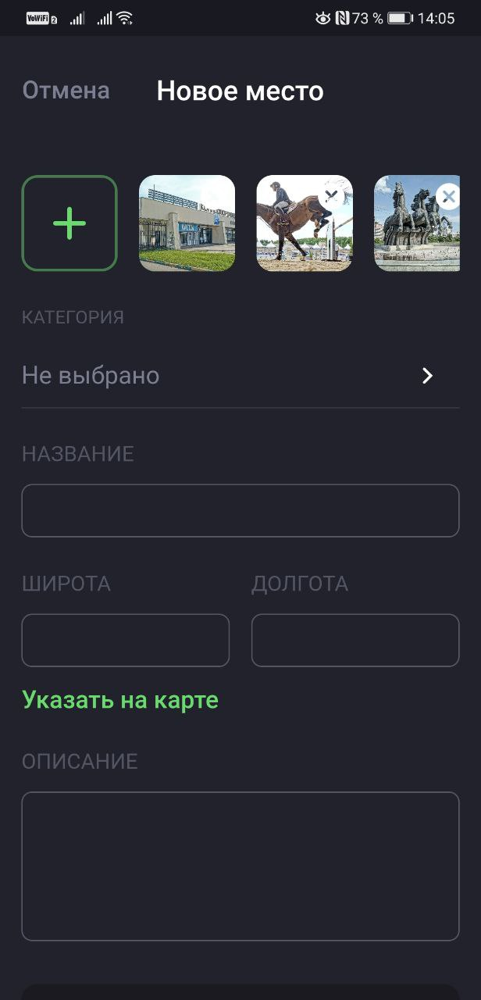

### Подробная информация о месте

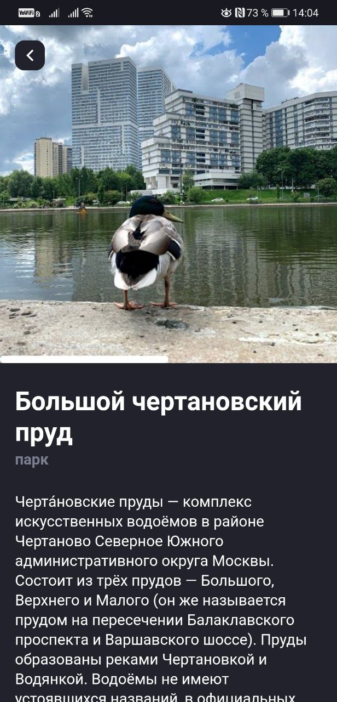

----

## Контакты

